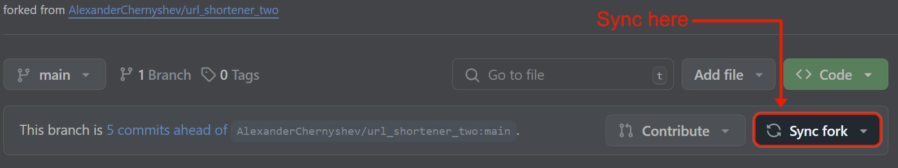

# NYWebPerf.com URL Shortener and analytics functionality

## Objectives and functions

The aim of this project is to extend the functionality of the original URL Shortener project to permit multiple links for one "rule", and to allow us to track the number of users using particular links for the purposes of discerning which platform users are arriving from. We can use these metrics to inform our community building, and to improve our maintenance of the commnity and events.


# Using URL Shortener

To use URL Shortener for your URLs, fork this repository.
In the redirectrules.ts file you will see an example rule for redirecting.
They will be structured like this:

```typescript
const redirects = [
    {
        destinationURL: 'https://www.wikipedia.org/',
        shortURL: 'wiki',
        // releaseDate: new Date('December 3, 2024 12:00:00')
    },
];
```

To create a basic rule, you just need to use one object and fill in the ```destinationURL``` (The site you wish to redirect to) and the ```shortURL```, which is what will be displayed as the shortened path.

To add more redirects, add another object to the ```redirects``` array structured the same way as the example.

### Route patterns

Short URLs can include named parameters that get captured from the path and substituted into the destination URL.

```typescript
{
    destinationURL: 'https://www.meetup.com/web-performance-ny/events/$eventId',
    shortURL: 'e/:eventId/:source?/:medium?/:campaign?',
}
```

Syntax:

- `:name` — required path segment captured as `name`.
- `:name?` — optional segment. The leading slash is also optional, so a pattern like `e/:eventId/:source?` matches both `/e/123` and `/e/123/twitter`.
- Literal segments (like `e` above) must match exactly.

Captured values are substituted into `destinationURL` using `$name`. Optional params that did not match are substituted with an empty string.

For matching needs that go beyond the simple syntax, pass a `RegExp` as `shortURL` and use named groups:

```typescript
{
    shortURL: /^\/event\/(?<eventId>\d+)$/,
    destinationURL: 'https://www.meetup.com/web-performance-ny/events/$eventId',
}
```

Rules are evaluated in array order — place exact-match short URLs before pattern rules that could also match them.

### Adding a release date

To add a release date to the redirect, add an optional ```releaseDate``` key (as seen in the example). Add a date in the format seen in the example.
This will prevent the redirect you specified from happening until the date you entered has been reached.

It is recommended to specify the timezone you would like used when entering a release date. Without entering a timezone, the timer would use the timezone of the server. UTC is a good timezone if unsure of what to use.

Before the release date, any visitors will instead see a page with the release date listed and with a timer showing the remaining time until the release date.

### Including "Unknown URL" handling

``` 
{
    unknownUrl: 'https://www.wikipedia.org/'
}
```

If you would like to include a case for entered paths that do not match any of your defined rules, you can add an object to the rules structured as in the example, and enter the URL you would like to redirect unknown paths to.

### "Default path" handling

```
{
    destinationURL: 'https://www.google.com/',
    shortURL: '',
    releaseDate: new Date('December 3, 2024 12:00:00')
},
```
If you would like to add a "default path", you can add an object to the rules that has an empty string as its ```shortURL``` property.
This will act like a "home page", as any paths without one of your short URLs will redirect here.

## Redirect logging

Every matched redirect is logged to a Cloudflare Durable Object (`RedirectLog`) backed by its embedded SQLite store. Logging runs after `sendRedirect` via `waitUntil`, so it never delays the 301.

### Schema

- `routes(id, path, short_url, destination_url)` with `UNIQUE(path, short_url, destination_url)` — deduplicated route signatures so the same path/pattern/destination triple is stored once regardless of how many times it is hit. `short_url` is the rule's pattern as written (or `RegExp.toString()` for regex rules); `destination_url` is fully substituted.
- `redirects(id, timestamp, route_id)` — one row per redirect hit, referencing the route.
- `variables(id, key, value)` with `UNIQUE(key, value)` — deduplicated captured route parameters.
- `redirect_variables(redirect_id, variable_id)` — many-to-many join enabling grouping and filtering by any variable.

The schema version is tracked via `PRAGMA user_version` in the DO's SQLite store. The DO constructor creates the current schema on a fresh deploy and migrates older schemas forward in place (e.g. the pre-normalization v1 `redirects` table is rewritten into `routes` + `redirects(route_id)`). No manual migration step is required.

### Deploying

The Worker is bundled from [worker.mjs](worker.mjs), which re-exports the Nitro handler and the `RedirectLog` class. `wrangler.jsonc` declares the DO binding `REDIRECT_LOG` and a `v1` migration that creates the SQLite-backed class on first deploy.

```
npm run build
npx wrangler deploy
```

Local development now runs under the Workers runtime via `npm run dev`, which builds the Nitro output and then starts `wrangler dev`. The `REDIRECT_LOG` DO is backed by an in-memory SQLite store locally, so logging works end-to-end without touching production. Re-run `npm run dev` after editing source to pick up changes (or run `nuxt build` in another terminal while `wrangler dev` stays up — it watches the bundled output).

### Updating your forks

If you have forked the repository for your personal use of the URL shortener, don't forget to check your fork page. Github has included a useful feature that lets you know if a fork has been updated, and let's you sync the source update with your fork with just one button click.

We highlight where you can find the button in the image below.



You can also read more about syncing forks in the github docs here: https://docs.github.com/en/pull-requests/collaborating-with-pull-requests/working-with-forks/syncing-a-fork
